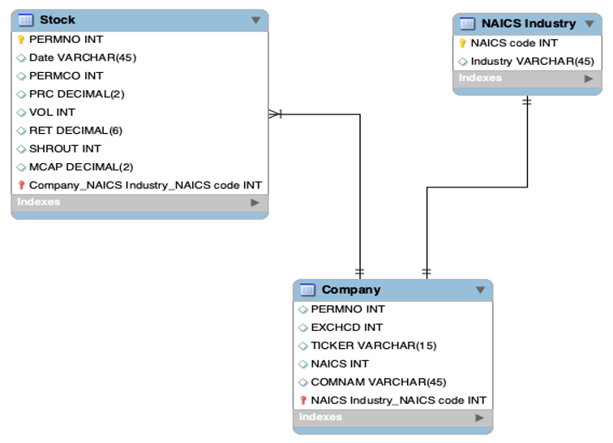
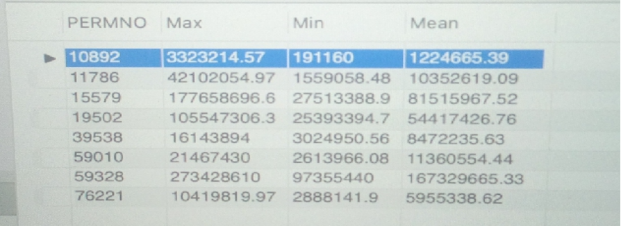

# 📈 SQL-Based Stock Market Analysis (2010–2022)

## 🔍 Overview  
This project demonstrates how SQL can be used to extract, analyze, and summarize key financial indicators from large-scale stock market data. Using a CRSP dataset of eight companies from 2010 to 2022, I explored trends in market capitalization, returns, and exchange/industry classification using structured queries and data modeling techniques.

---

## 📁 Dataset Details

- **Source**: [CRSP – Center for Research in Security Prices](https://www.crsp.org/)
- **Companies**:  
  - WSFS Financial Corp  
  - SVB Financial Group  
  - Texas Instruments Inc.  
  - Walgreens Boots Alliance Inc.  
  - Mattel Inc.  
  - GAP Inc.  
  - Intel Corp  
  - Rio Tinto Plc
- **Time Frame**: Monthly data from January 2010 to December 2022  
- **Variables**:
  - `PERMNO`: Unique stock identifier
  - `COMNAM`: Company name
  - `EXCHCD`: Exchange code (e.g., NASDAQ = 3)
  - `TICKER`: Stock ticker
  - `NAICS`: Industry classification (2-digit)
  - `PRC`: Last trading price (USD)
  - `VOL`: Volume of shares traded
  - `RET`: Monthly return
  - `SHROUT`: Shares outstanding
  - `MCAP`: Market Capitalization = PRC × SHROUT

---

## 🧠 Entity-Relationship (ER) Model

The ER diagram below illustrates how stock, company, and industry entities are structured:



---

## 📊 Market Capitalization Statistics

SQL query used:
```sql
SELECT PERMNO, MAX(MCAP) 'Max', MIN(MCAP) 'Min', ROUND(AVG(MCAP), 2) 'Mean'
FROM assignment2223.a1crspm
GROUP BY PERMNO;
```

### ➤ Visualization of Results:


---

## 🧾 Industry & Exchange-Based Filtering (Compound SQL Query)

SQL `UNION` query:
```sql
SELECT PERMNO, COMNAM, EXCHCD, TICKER, NAICS 
FROM assignment2223.a1crspf WHERE EXCHCD = 3
UNION 
SELECT PERMNO, COMNAM, EXCHCD, TICKER, NAICS
FROM assignment2223.a1crspf WHERE NAICS = 52
ORDER BY PERMNO;
```

---

## 📉 View: Monthly Returns Under 3%

SQL `VIEW` created:
```sql
CREATE VIEW assignment2223.Returns AS
SELECT DATE_FORMAT(date, '%M %Y') AS Date, PERMNO, PERMCO, PRC, VOL, ROUND(RET, 4) AS RET, SHROUT, MCAP
FROM assignment2223.a1crspm
WHERE RET < 0.03;
```

### ➤ Sample Output:


---

## 💬 Discussion: Is SQL Essential for Financial Analysts?

- SQL is foundational for **querying**, **filtering**, and **aggregating** large financial datasets.
- Its limitations include advanced statistical modeling (e.g., ARIMA, regression, machine learning).
- Integration with tools like **SparkSQL**, **Python (pandas, statsmodels)**, and **Power BI/Tableau** can fill in gaps.

---

## 🚀 Project Highlights

| Feature                        | Description |
|-------------------------------|-------------|
| 🧠 ER Modeling                | Company–Stock–Industry structure using primary/foreign keys |
| 📊 Market Cap Analysis        | MIN/MAX/AVG per firm via SQL aggregation |
| 🧾 Conditional Queries        | Compound filtering on industry and exchange |
| 📉 Return View                | Focused analysis on sub-3% returns for volatility assessment |
| 🔧 Tools Used                 | SQL (MySQL), CRSP data, ER diagrams, data visualization tools |

---

## 📌 Next Steps

- Add **Python** for advanced time series modeling and forecasting
- Visualize trends with **Tableau or Power BI**
- Expand dataset to include more firms and exchanges
